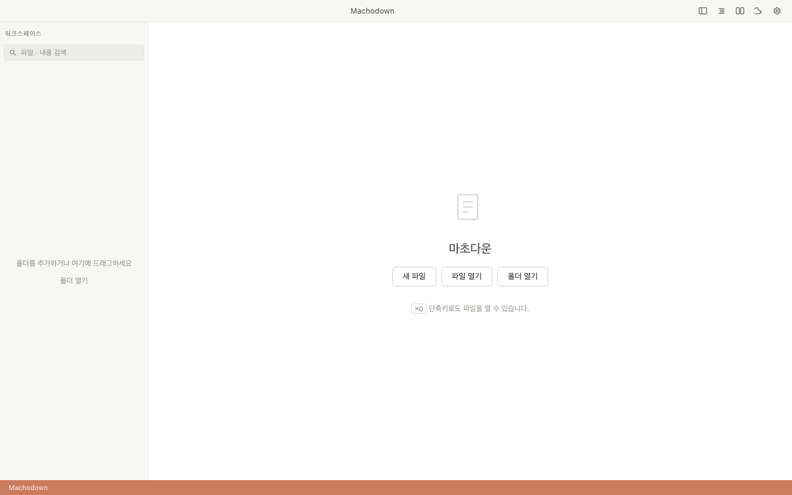

[한국어](README.ko.md)

<div align="center">
  
  <h1>Machodown</h1>
  <p>A Monaco Editor-based Markdown editor for macOS and Linux.<br/>Write beautifully. Think clearly.</p>

  [](LICENSE)
  [](https://github.com/hongmacho/machodown/releases)
  [](https://github.com/hongmacho/machodown/actions/workflows/ci.yml)
  [](https://github.com/hongmacho/machodown/releases)
</div>

---


---

## Why Machodown?

Most Markdown editors are either too minimal or too bloated. Machodown brings the **VS Code editing experience** — Monaco Editor, real-time preview, multi-tab workspace — packaged as a focused desktop app.

No subscriptions. No cloud sync. Just your files, your way.

---

## Features

| | Feature | Description |
|---|---|---|
| ✍️ | **Monaco Editor** | Full VS Code editor engine — autocomplete, syntax highlight, regex search |
| 👁️ | **Live Preview** | GFM, KaTeX math, code highlight, auto-scroll sync |
| 🪟 | **Flexible Views** | Editor-only / Preview-only / Split view, toggled instantly |
| 📑 | **Multi-tab** | Open multiple files side by side with persistent state |
| 💾 | **Auto-save** | Configurable interval + crash recovery backup |
| 📁 | **Workspace** | Folder-based sidebar file explorer |
| 🔄 | **File Watch** | External change detection and conflict resolution |
| 🔍 | **Search & Replace** | Regex-powered find & replace across the editor |
| 🎨 | **Themes** | Light / Dark / System auto |
| ⬆️ | **Auto-update** | Silent updates via GitHub Releases |
| 📐 | **KaTeX Math** | Full LaTeX math rendering inline and block |
| 📋 | **TOC Panel** | Auto-generated table of contents sidebar |
| ⌨️ | **Command Palette** | `Cmd+K` for everything |

---

## Screenshots

<table>
  <tr>
    <td></td>
    <td></td>
  </tr>
  <tr>
    <td align="center"><em>Split View — Dark</em></td>
    <td align="center"><em>Split View — Light</em></td>
  </tr>
  <tr>
    <td></td>
    <td></td>
  </tr>
  <tr>
    <td align="center"><em>Editor Focus</em></td>
    <td align="center"><em>Preview Focus</em></td>
  </tr>
</table>

---

## Installation

### macOS (Recommended)

Download from [Releases](https://github.com/hongmacho/machodown/releases):

| Chip | File |
|---|---|
| Apple Silicon (M1/M2/M3) | `Machodown-1.0.0-arm64.dmg` |
| Intel | `Machodown-1.0.0-x64.dmg` |

> Code-signed and notarized by Apple — no "unidentified developer" warnings.

### Linux

| Format | File |
|---|---|
| AppImage | `Machodown-1.0.0-x86_64.AppImage` |
| Debian / Ubuntu | `machodown_1.0.0_amd64.deb` |

```bash
# AppImage
chmod +x Machodown-*.AppImage && ./Machodown-*.AppImage

# deb
sudo dpkg -i machodown_*.deb
```

### Homebrew (macOS)

> Homebrew Cask submission is [in review](https://github.com/Homebrew/homebrew-cask/pull/265869). Once merged:

```bash
brew install --cask machodown
```

---

## Keyboard Shortcuts

### File

| Shortcut | Action |
|---|---|
| `Cmd/Ctrl + N` | New file |
| `Cmd/Ctrl + O` | Open file |
| `Cmd/Ctrl + S` | Save |
| `Cmd/Ctrl + Shift + S` | Save as |
| `Cmd/Ctrl + W` | Close tab |

### View

| Shortcut | Action |
|---|---|
| `Cmd/Ctrl + \` | Toggle sidebar |
| `Cmd/Ctrl + Shift + E` | Editor only |
| `Cmd/Ctrl + Shift + V` | Preview only |
| `Cmd/Ctrl + Shift + B` | Split view |

### Edit

| Shortcut | Action |
|---|---|
| `Cmd/Ctrl + F` | Find |
| `Cmd/Ctrl + H` | Find & replace |
| `Cmd/Ctrl + /` | Toggle comment |
| `Cmd/Ctrl + K` | Command palette |

### Tabs

| Shortcut | Action |
|---|---|
| `Cmd/Ctrl + 1–9` | Jump to tab |
| `Cmd/Ctrl + Tab` | Next tab |
| `Cmd/Ctrl + Shift + Tab` | Previous tab |

---

## Development

```bash
git clone https://github.com/hongmacho/machodown.git
cd machodown
npm install
npm run dev
```

### Commands

```bash
npm run typecheck   # Type check
npm test            # Unit tests
npm run lint        # Lint
npm run build       # Production build
npm run package     # Package for current OS
```

### Stack

- **Electron 28** + **electron-vite 2**
- **React 18** + **TypeScript 5** (strict)
- **Monaco Editor** — editor engine
- **markdown-it** — Markdown parsing
- **KaTeX** — math rendering
- **Zustand** — state management
- **Vitest** — unit tests

---

## Requirements

| OS | Minimum |
|---|---|
| macOS | 12 Monterey |
| Linux | Ubuntu 20.04 (x64) |

---

## Contributing

Issues and PRs are welcome. See [CONTRIBUTING.md](CONTRIBUTING.md) for guidelines.

---

## License

[MIT](LICENSE)
