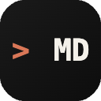
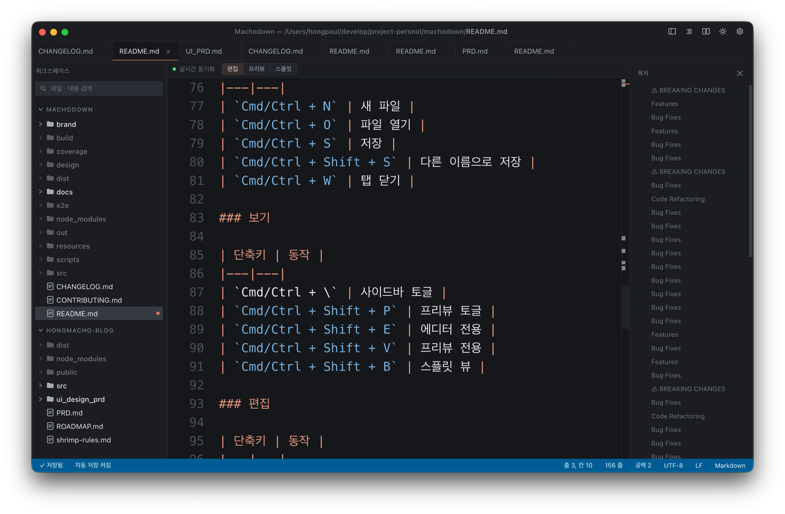

<div align="center">
  
  <h1>Machodown</h1>
  <p>Electron 기반 데스크톱 마크다운 에디터</p>

  [](LICENSE)
  [](https://github.com/hongmacho/machodown/releases)
  [](https://github.com/hongmacho/machodown/actions/workflows/ci.yml)
</div>

마크다운 Editor + 실시간 프리뷰 + 멀티탭 + 워크스페이스를 지원합니다.

## 스크린샷



## 기능

- **멀티탭 편집** — 여러 파일을 탭으로 동시에 열기
- **실시간 프리뷰** — GFM, KaTeX 수식, 코드 하이라이팅, TOC 지원
- **스플릿 뷰** — 에디터 / 프리뷰 / 에디터+프리뷰 전환
- **스크롤 싱크** — 에디터↔프리뷰 양방향 스크롤 동기화
- **워크스페이스** — 폴더 기반 사이드바 파일 탐색
- **파일 감시** — 외부 변경 감지 및 충돌 해소
- **자동저장** — 설정 가능한 간격으로 자동 저장
- **백업** — 비정상 종료 시 복구 지원
- **검색 & 교체** — 정규식 지원 에디터 내 검색
- **테마** — 라이트 / 다크 / 시스템 자동
- **자동 업데이트** — GitHub Releases를 통한 자동 업데이트

## 시스템 요구사항

| OS | 지원 버전 |
|---|---|
| macOS | 12 Monterey 이상 |
| Windows | Windows 10 이상 (x64) |
| Linux | Ubuntu 20.04 이상 (x64) |

## 설치

### macOS
1. [Releases](https://github.com/hongmacho/machodown/releases) 페이지에서 `Machodown-{version}-arm64.dmg` (Apple Silicon) 또는 `Machodown-{version}-x64.dmg` (Intel) 다운로드
2. DMG를 열고 Applications 폴더로 드래그

### Windows
1. `Machodown-{version}-x64.exe` (NSIS 설치 프로그램) 또는 `Machodown-{version}-x64-portable.exe` (포터블) 다운로드
2. 설치 프로그램 실행

### Linux
1. `Machodown-{version}-x64.AppImage` 또는 `machodown_{version}_amd64.deb` 다운로드
2. AppImage: `chmod +x Machodown-*.AppImage && ./Machodown-*.AppImage`
3. deb: `sudo dpkg -i machodown_*.deb`

## 키보드 단축키

### 파일

| 단축키 | 동작 |
|---|---|
| `Cmd/Ctrl + N` | 새 파일 |
| `Cmd/Ctrl + O` | 파일 열기 |
| `Cmd/Ctrl + S` | 저장 |
| `Cmd/Ctrl + Shift + S` | 다른 이름으로 저장 |
| `Cmd/Ctrl + W` | 탭 닫기 |

### 보기

| 단축키 | 동작 |
|---|---|
| `Cmd/Ctrl + \` | 사이드바 토글 |
| `Cmd/Ctrl + Shift + P` | 프리뷰 토글 |
| `Cmd/Ctrl + Shift + E` | 에디터 전용 |
| `Cmd/Ctrl + Shift + V` | 프리뷰 전용 |
| `Cmd/Ctrl + Shift + B` | 스플릿 뷰 |

### 편집

| 단축키 | 동작 |
|---|---|
| `Cmd/Ctrl + F` | 검색 |
| `Cmd/Ctrl + H` | 검색 & 교체 |
| `Cmd/Ctrl + Z` | 실행 취소 |
| `Cmd/Ctrl + Shift + Z` | 다시 실행 |
| `Cmd/Ctrl + /` | 행 주석 토글 |
| `Tab` | 들여쓰기 |
| `Shift + Tab` | 내어쓰기 |

### 탭

| 단축키 | 동작 |
|---|---|
| `Cmd/Ctrl + 1~9` | 탭 직접 이동 |
| `Cmd/Ctrl + Tab` | 다음 탭 |
| `Cmd/Ctrl + Shift + Tab` | 이전 탭 |

### 기타

| 단축키 | 동작 |
|---|---|
| `Cmd/Ctrl + ,` | 설정 열기 |
| `Cmd/Ctrl + K` | 명령어 팔레트 |
| `Cmd/Ctrl + Shift + ?` | 단축키 목록 |

## 개발 환경 세팅

```bash
git clone https://github.com/hongmacho/machodown.git
cd machodown
npm install
npm run dev
```

### 주요 명령어

```bash
npm run typecheck   # 타입 체크
npm test            # 단위 테스트
npm run test:watch  # 테스트 (watch)
npm run lint        # 린트
npm run build       # 빌드
npm run package     # 패키지 생성 (현재 OS)
```

## 기술 스택

- **Electron 28** + **electron-vite 2**
- **React 18** + **TypeScript 5** (strict)
- **Monaco Editor** — 코드 에디터 엔진
- **markdown-it** — 마크다운 파싱
- **KaTeX** — 수식 렌더링
- **Zustand** — 상태 관리
- **Vitest** — 단위 테스트
- **Playwright** — E2E 테스트
- **electron-updater** — 자동 업데이트

## 라이선스

[MIT](LICENSE)
